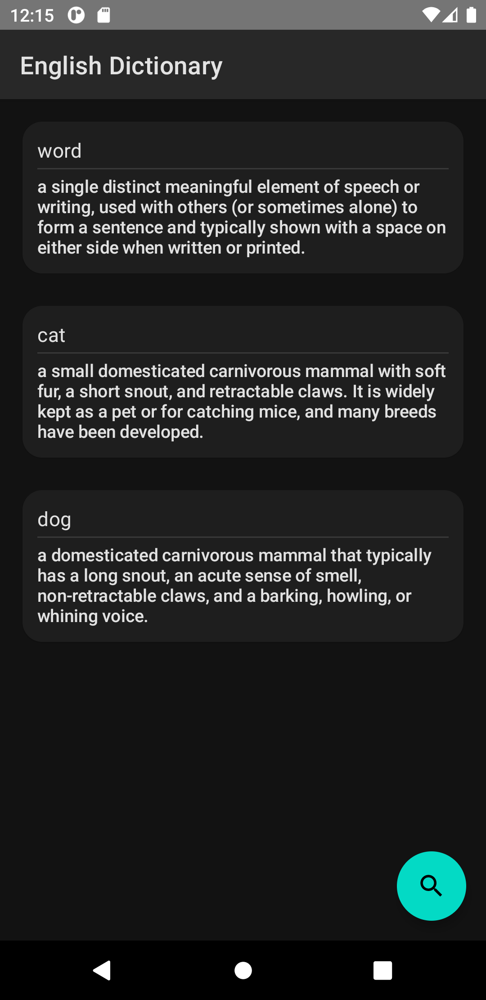
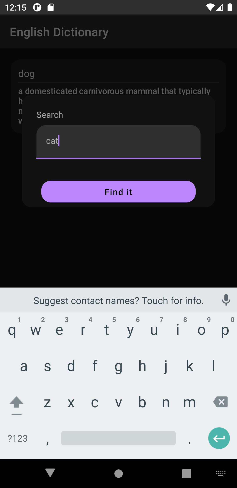
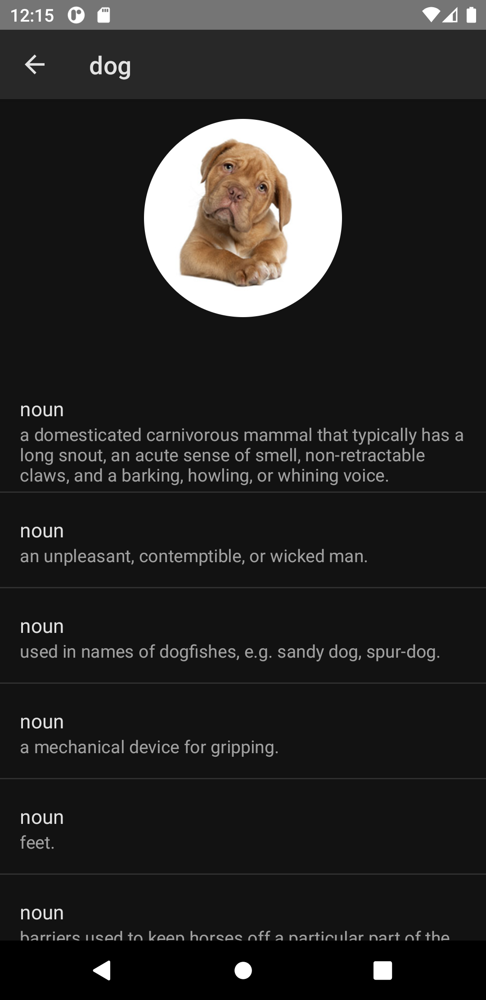
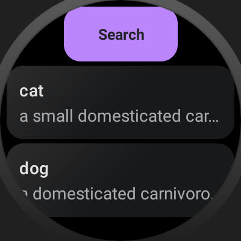
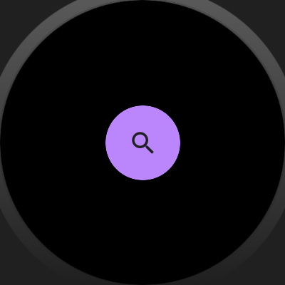
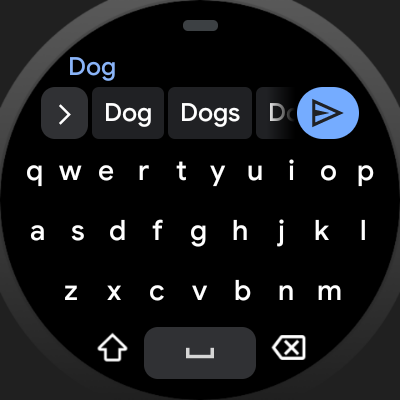
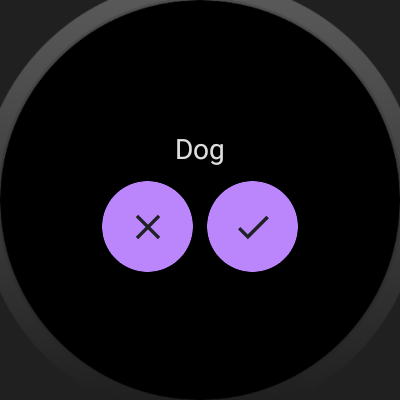
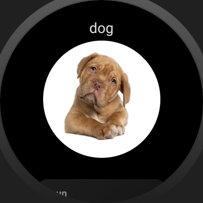
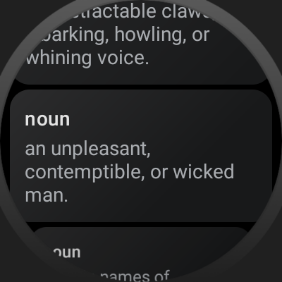

# EnglishDictionary
A simple Android / Wear OS app to search for definitions of some english word 

## Features

It provides following functionality to the user:
- Search for definitions of an english word
- See the history of your search requests

## How it looks
### Mobile

### Wear

## Architecture
There are three modules in the app:
- *core* - core functionality, data, domain and presentation layers
- *mobile* - ui layer of mobile app
- *wear* - ui layer of wear app

## Tech Stack
### Core
- Android Studio
- Kotlin
- Android framework
- [Jetpack Compose Mobile](https://developer.android.com/jetpack/compose)
- [Jetpack Compose Wear](https://developer.android.com/training/wearables/compose-setup)
### Third party libraries
- [Coil](https://coil-kt.github.io/coil/) - image loading
- [Retrofit](https://github.com/square/retrofit) - HTTP network library
- [Moshi](https://github.com/square/moshi) - Json library
- [Room](https://developer.android.com/training/data-storage/room) - abstraction layer over SQLite
- [Dagger 2](https://dagger.dev/) - DI framework
- [Kotlin coroutines](https://github.com/Kotlin/kotlinx.coroutines) -  asynchronous programming
- [ViewModel](https://developer.android.com/topic/libraries/architecture/viewmodel) - is designed to store and manage UI-related data in a lifecycle conscious

## API
- [Free Dictionary API](https://dictionaryapi.dev/)
- [Glyffix Images API](http://www.glyffix.com/Help)

## Generating signed APK
From Android Studio:
1. ***Build*** menu
2. ***Generate Signed APK...***
3. Fill in the keystore information *(you only need to do this once manually and then let Android Studio remember it)*
